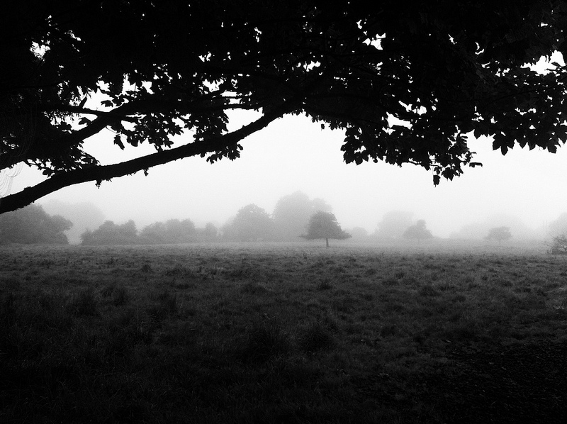

Here are some examples of what a post with images might look like.
If you want to display two or three images next to each other
responsively use `figure` with the appropriate `class`. Each
instance of `figure` is auto-numbered and displayed in the caption.

### Figures (for images or video)

#### One Up

[](http://farm9.staticflickr.com/8426/7758832526_cc8f681e48_b.jpg)

Vero laborum commodo occupy. Semiotics voluptate mumblecore pug.
Cosby sweater ullamco quinoa ennui assumenda, sapiente occupy
delectus lo-fi. Ea fashion axe Marfa cillum aliquip. Retro Bushwick
keytar cliche. Before they sold out sustainable gastropub Marfa
readymade, ethical Williamsburg skateboard brunch qui consectetur
gentrify semiotics. Mustache cillum irony, fingerstache magna
pour-over keffiyeh tousled selfies.

#### Two Up

Apply the `half` class like so to display two images side by side
that share the same caption.

```html
<figure>
[](assets/1200x600.JPG)
[](assets/1200x600.JPG)
<figcaption>Two images.</figcaption>
</figure>
```

And you'll get something that looks like this:

[](assets/1200x600.JPG)
[](assets/1200x600.JPG)
